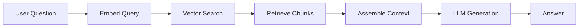
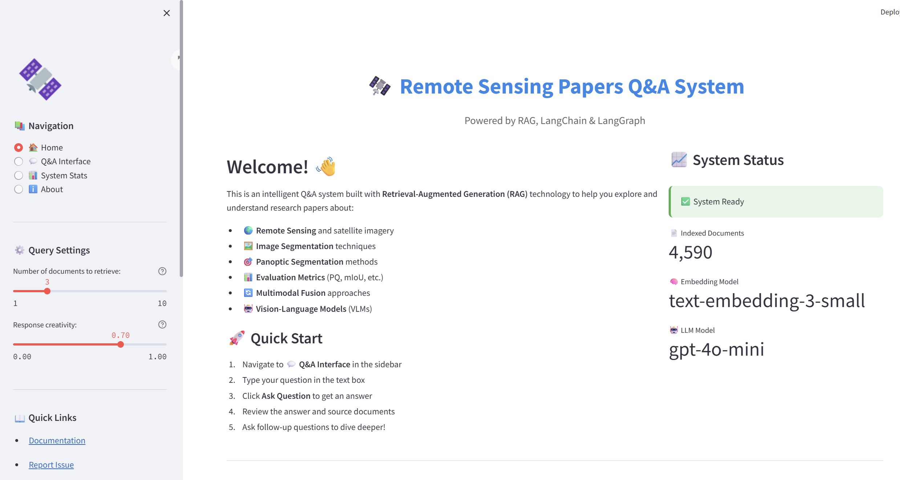
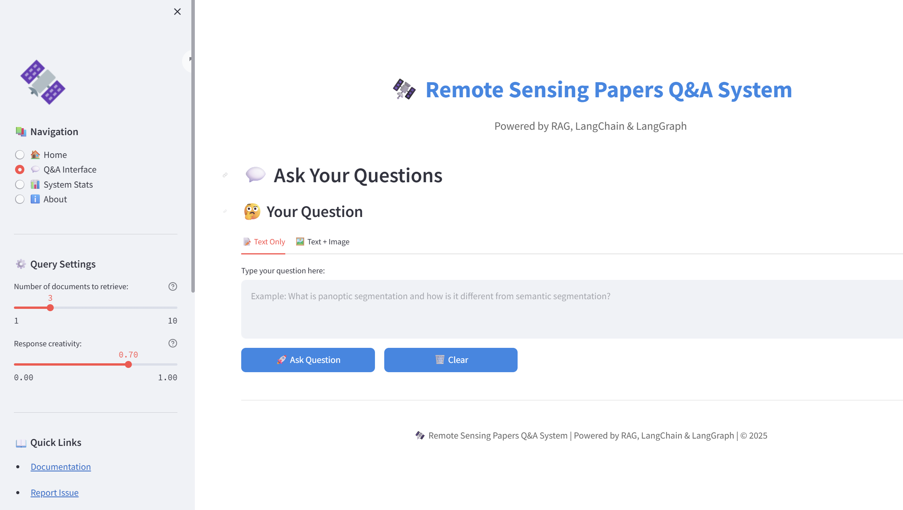
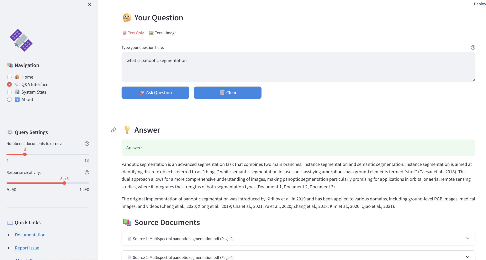
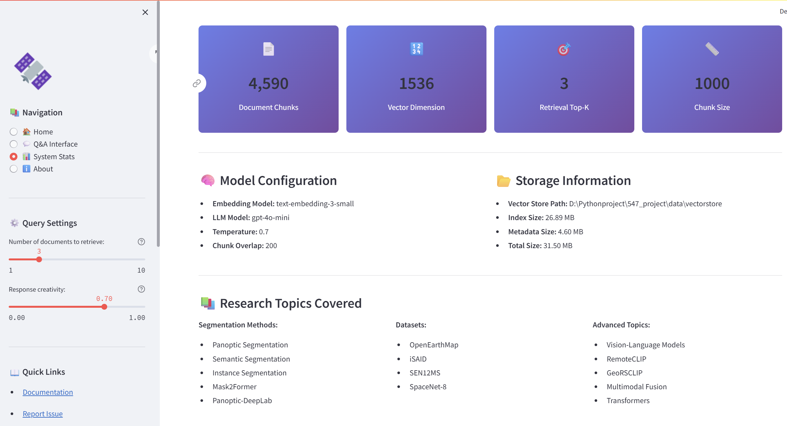

# Remote Sensing Papers RAG Q&A System

A Retrieval-Augmented Generation (RAG) system built with LangChain and LangGraph for answering questions about remote sensing and image segmentation research papers.

## 🌟 Features

- **Document Processing**: Automatic loading and processing of PDF research papers
- **Intelligent Chunking**: Smart text splitting with overlap for context preservation
- **Vector Search**: FAISS-based vector storage for efficient similarity search
- **LangGraph Workflow**: Sophisticated RAG pipeline with state management
- **Interactive CLI**: User-friendly command-line interface for Q&A
- **OpenAI Integration**: Powered by OpenAI's embedding and language models
- **🆕 Multimodal Input**: Support for both text and image inputs (diagrams, figures, screenshots)
- **🆕 Vision Analysis**: Uses GPT-4o/GPT-4o-mini vision capabilities to analyze images
- **🆕 LaTeX Math Support**: Properly renders mathematical formulas and equations in answers

## 📋 Prerequisites

- Python 3.8 or higher
- OpenAI API key
- PDF documents (research papers)

## 🚀 Installation

1. **Clone the repository**
```bash
git clone <your-repo-url>
cd 547_project
```

2. **Install dependencies**
```bash
pip install -r requirements.txt
```

3. **Configure environment variables**
```bash
cp .env.example .env
# Edit .env and add your OpenAI API key
```

## 📁 Project Structure

```
547_project/
├── papers/                     # Directory containing PDF research papers
├── src/                        # Source code
│   ├── __init__.py
│   ├── document_processor.py  # Document loading and chunking
│   ├── vector_store.py        # Vector database operations
│   ├── rag_graph.py           # LangGraph RAG workflow
│   └── utils.py               # Utility functions
├── data/                       # Data storage
│   └── vectorstore/           # FAISS vector database
├── examples/                   # Usage examples
│   └── example_usage.py       # Python API examples
├── main.py                     # Main CLI application
├── streamlit_app.py           # Web interface application
├── config.py                   # Configuration management
├── requirements.txt            # Python dependencies
├── .env                        # Environment variables (configured)
├── .gitignore                 # Git ignore rules
└── README.md                  # This file
```

## 💻 Usage

### 1. Index Documents

First, index your PDF documents to create the vector database:

```bash
python main.py --index
```

This will:
- Load all PDF files from the `papers/` directory
- Split documents into chunks
- Generate embeddings
- Store vectors in FAISS database

### 2. Ask Questions

**Option A: Web Interface (Recommended)**

Start the beautiful web interface:

```bash
streamlit run streamlit_app.py
```

Then open your browser to `http://localhost:8501` and enjoy:
- 🎨 Beautiful, intuitive UI
- 💬 Interactive Q&A interface
- 🖼️ **Multimodal input**: Upload images (diagrams, figures) along with your questions
- 📊 Real-time statistics
- 📚 Source citations with previews
- 📈 Performance metrics
- 📜 Question history

**New Multimodal Feature:**
The web interface now supports two input modes:
- **📝 Text Only**: Traditional text-based questions
- **🖼️ Text + Image**: Upload images from papers (diagrams, charts, screenshots) and ask questions about them

The system will analyze the image using GPT-4o's vision capabilities while also retrieving relevant context from your research papers!

**Math Formula Support:**
The system properly renders mathematical formulas in the answers. When asking about metrics, equations, or technical concepts, the answers will include properly formatted LaTeX formulas:
- Inline formulas: $PQ = SQ \times RQ$
- Block formulas for complex equations
- Perfect for understanding evaluation metrics like Panoptic Quality, IoU, F1 scores, etc.

**Option B: Command Line**

Query the system via CLI:

```bash
python main.py --query "What are the main evaluation metrics for panoptic segmentation?"
```

Or start an interactive CLI session:

```bash
python main.py --interactive
```

### 3. Advanced Options

**CLI Options:**

```bash
# Specify custom papers directory
python main.py --index --papers-dir /path/to/papers

# Adjust chunk size and overlap
python main.py --index --chunk-size 1000 --chunk-overlap 200

# Set number of retrieved documents
python main.py --query "Your question" --top-k 5
```

**Web Interface Options:**

```bash
# Run on different port
streamlit run streamlit_app.py --server.port 8502

# Allow remote access
streamlit run streamlit_app.py --server.address 0.0.0.0

# Debug mode
streamlit run streamlit_app.py --logger.level=debug
```

Adjust settings via the **sidebar** in the web interface:
- Number of documents to retrieve (top-k slider)
- Response creativity (temperature slider)
- Real-time configuration without restart

### 4. Using Multimodal Features (Image + Text)

Start the web app:

```bash
streamlit run streamlit_app.py

# Or on a different port
streamlit run streamlit_app.py --server.port 8502
```

Then:
1. Navigate to the **💬 Q&A Interface** page
2. Click on the **🖼️ Text + Image** tab
3. Upload an image (PNG, JPG, JPEG, WEBP)
4. Type your question about the image
5. Click **🚀 Ask Question**
6. The system will analyze both the image and relevant papers!

## 🔧 Configuration

Edit `config.py` to customize:

- **Embedding model**: Default is `text-embedding-3-small`
- **LLM model**: Default is `gpt-4o-mini`
- **Chunk size**: Default is 1000 characters
- **Chunk overlap**: Default is 200 characters
- **Top K results**: Default is 3 retrieved documents

## 🏗️ Architecture

The system uses LangGraph to orchestrate the RAG pipeline:

1. **Question Processing**: User query is received and embedded
2. **Retrieval**: Most relevant document chunks are retrieved from vector store
3. **Context Assembly**: Retrieved chunks are formatted with the question
4. **Generation**: LLM generates answer based on context
5. **Response**: Answer is returned to the user



## 🖼️ Multimodal Usage Examples

The system now supports vision-enabled queries! Here are some example use cases:

**Example 1: Analyzing Diagrams**
- Upload: A diagram showing panoptic segmentation architecture
- Question: "Can you explain this network architecture and how it compares to the methods discussed in the papers?"

**Example 2: Understanding Figures**
- Upload: A chart showing performance metrics
- Question: "What evaluation metrics are shown in this figure and how do they relate to Panoptic Quality?"

**Example 3: Comparing Results**
- Upload: A results table or visualization
- Question: "Compare the results shown in this image with the benchmarks mentioned in the research papers."

**Example 4: Explaining Concepts**
- Upload: A screenshot of equations or formulas
- Question: "Can you explain this formula and its role in remote sensing segmentation?"

## 📚 Technologies Used

- **LangChain**: Framework for LLM applications
- **LangGraph**: State machine for complex workflows
- **FAISS**: Vector similarity search
- **OpenAI**: Embeddings and language models (including GPT-4o vision)
- **Streamlit**: Web interface framework
- **PyPDF**: PDF document processing
- **Rich**: Beautiful CLI formatting

## 🤝 Contributing

Contributions are welcome! Please feel free to submit a Pull Request.

## 🖼️ Screenshots

### Web Interface

**Home Page**

*Main landing page with project overview and navigation*

**Q&A Interface**

*Interactive question-answering interface with text and multimodal input options*

**Q&A Sample**

*Example of Q&A interaction with source citations and detailed answers*

**System Statistics**

*Real-time system statistics showing document counts, embeddings, and performance metrics*

**About Page**

*Project information and technical details*

## 📄 License

This project is licensed under the MIT License.

## 🙏 Acknowledgments

- Research papers in the `papers/` directory are from various authors and conferences
- Built with LangChain and LangGraph frameworks
- Powered by OpenAI's GPT models
- Web interface built with Streamlit

