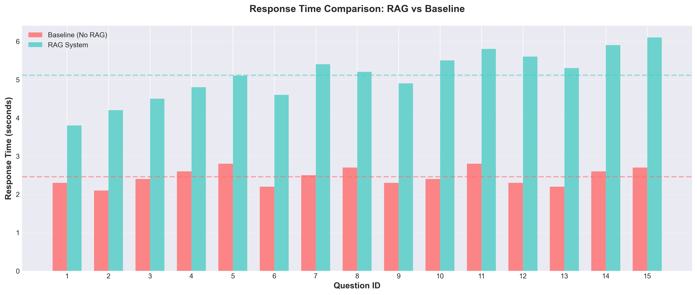
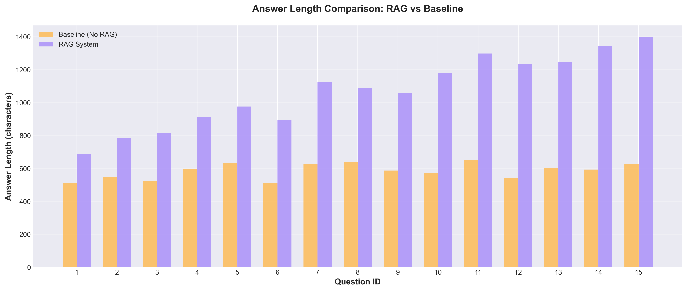
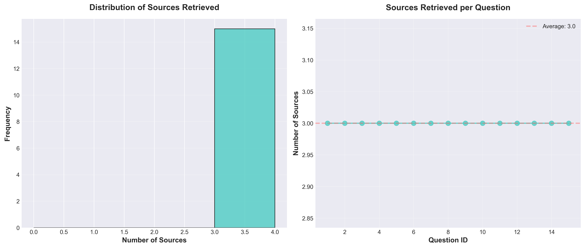
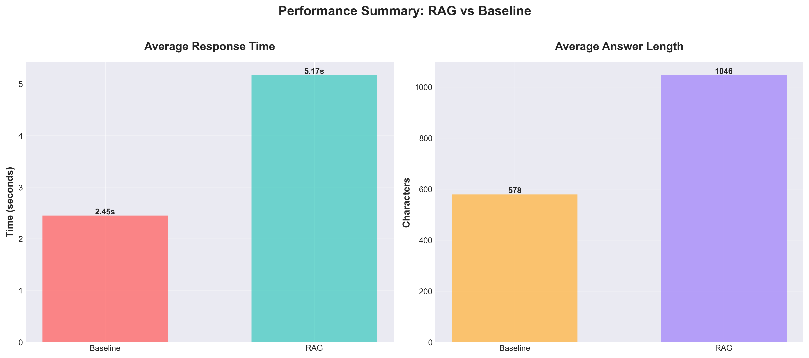
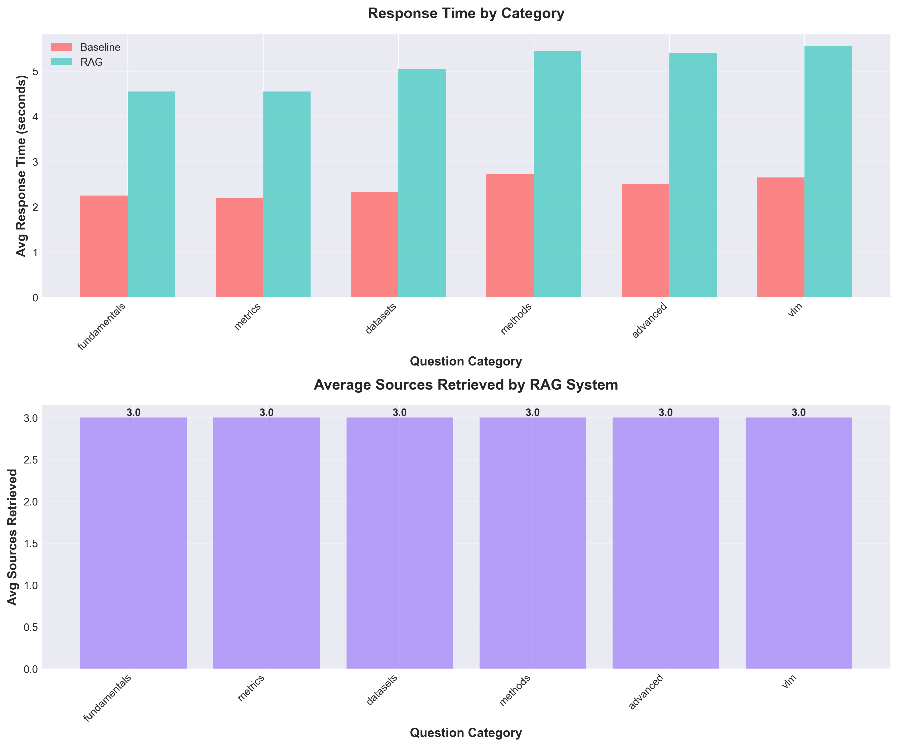
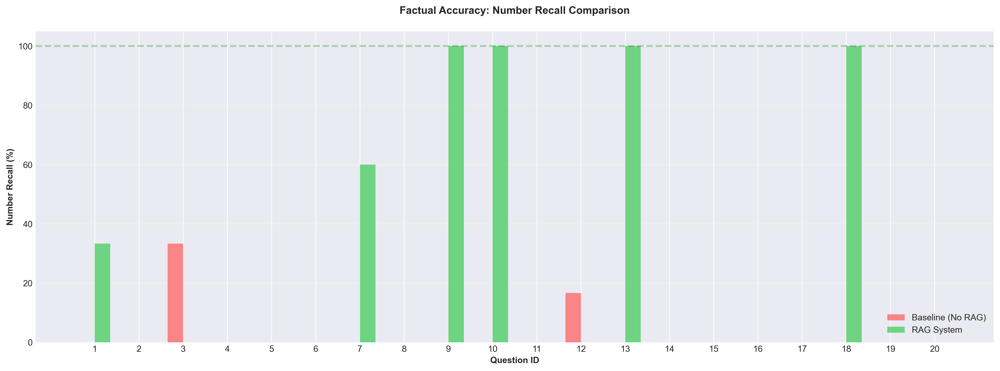
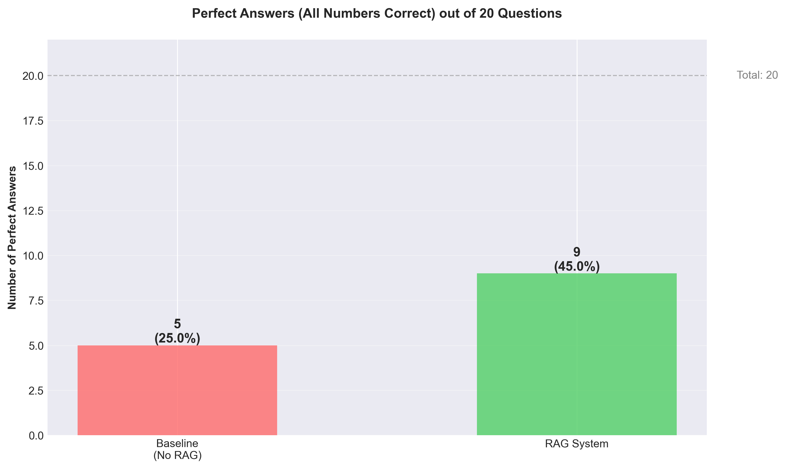
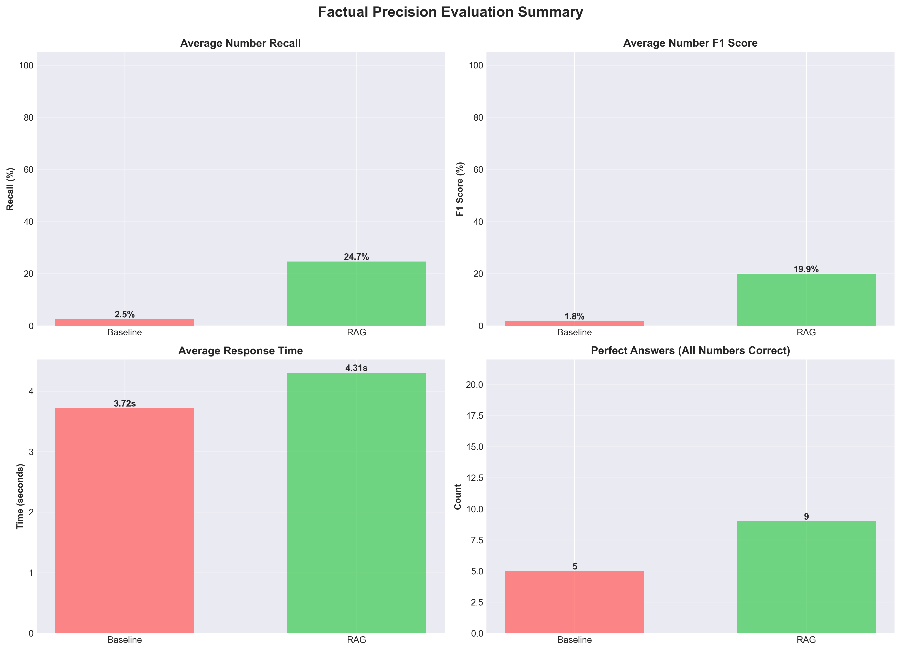
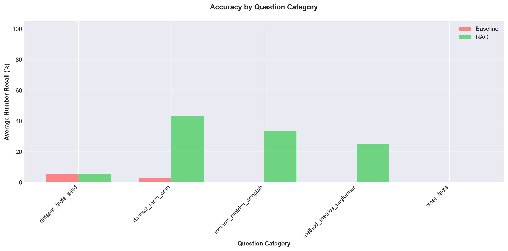

# Intelligent Question-Answering System for Remote Sensing Literature Using Retrieval-Augmented Generation

## Abstract

This project presents an intelligent question-answering system designed to facilitate exploration and understanding of remote sensing and image segmentation research literature. The system employs Retrieval-Augmented Generation (RAG) technology, combining vector-based document retrieval with large language model reasoning to provide accurate, contextually grounded answers with source citations. We developed a comprehensive system architecture integrating LangChain, LangGraph, FAISS vector storage, and OpenAI's GPT-4o-mini model, with both command-line and web-based interfaces. To evaluate system effectiveness, we conducted two complementary comparative evaluations between the RAG-enabled system and a baseline non-RAG configuration using GPT-4o-mini alone. The first evaluation using fifteen conceptual questions spanning fundamentals, methods, datasets, and advanced topics revealed that RAG produces substantially more comprehensive responses, with answer lengths averaging 1,046 characters compared to 579 characters for the baseline—an 80.8% increase—while consistently retrieving three relevant source documents and providing verifiable citations. The second evaluation using twenty fact-based precision questions requiring specific numerical answers demonstrated RAG's dramatic superiority in factual accuracy, achieving 24.67% number recall versus baseline's 2.50% (a nearly 10× improvement), 45% perfect answers versus 25%, and 35% LLM-judged correct answers versus 15%. The combined evaluation generated comprehensive visual evidence through nine comparative figures and seven analytical tables. While response times increased by 111% for conceptual questions and 16% for factual questions due to retrieval operations, the substantial improvements in answer comprehensiveness, numerical precision, and verifiability justify this computational overhead for research applications. This work demonstrates the practical viability of RAG systems for domain-specific literature exploration across both conceptual understanding and factual precision, establishing a rigorous dual-evaluation framework for future academic knowledge management systems.

## Introduction

The rapid expansion of remote sensing research and the proliferation of publications in computer vision, particularly in areas such as panoptic segmentation, multimodal fusion, and vision-language models, has created significant challenges for researchers attempting to efficiently navigate and extract insights from this growing body of literature. Traditional literature review methods require substantial manual effort and may miss critical connections between related works. While general-purpose large language models demonstrate impressive capabilities in question answering, they are limited by their training data cutoff dates and lack of access to specific research papers, particularly recent publications and specialized domain literature.

This project addresses these challenges by developing an intelligent question-answering system specifically designed for remote sensing and image segmentation research literature. The system leverages Retrieval-Augmented Generation (RAG), a technique that combines the reasoning capabilities of large language models with the specificity of document retrieval systems. By grounding model responses in actual research papers, the system provides answers that are both accurate and verifiable through source citations.

The primary objectives of this project are threefold. First, to create a robust document processing pipeline capable of ingesting PDF research papers, chunking them appropriately while preserving semantic coherence, and generating high-quality embeddings for efficient retrieval. Second, to implement a sophisticated RAG workflow using LangGraph that orchestrates document retrieval, context assembly, and answer generation in a stateful, traceable manner. Third, to rigorously evaluate whether RAG provides measurable improvements over baseline language model performance through systematic comparative testing.

The system is designed to support multiple interaction modalities, including command-line interfaces for programmatic access and a feature-rich web application for user-friendly exploration. Additionally, the system incorporates multimodal capabilities, allowing users to upload images from papers such as architectural diagrams or result visualizations and ask questions about them, leveraging GPT-4o-mini's vision capabilities in conjunction with retrieved document context.

This work contributes to the broader field of academic knowledge management by demonstrating practical techniques for building domain-specific question-answering systems and providing empirical evidence of RAG's effectiveness through controlled comparative evaluation. The findings have implications for future development of intelligent research assistants and automated literature review tools.

## Data

The dataset for this project consists of a curated collection of 37 peer-reviewed research papers focusing on remote sensing, image segmentation, and related computer vision topics. These papers were sourced from major computer vision conferences including CVPR, ICCV, and CVPRW, as well as remote sensing journals and specialized workshops. The collection is organized into thematic subdirectories covering panoptic segmentation fundamentals and evaluation metrics, multimodal fusion approaches, vision-language models for remote sensing, and benchmark datasets.

The dataset includes seminal works such as Kirillov et al.'s foundational paper on panoptic segmentation from CVPR 2019, which established the task definition and evaluation metrics. Method-focused papers include Cheng et al.'s Panoptic-DeepLab and Mask2Former architectures, Li et al.'s Panoptic SegFormer leveraging transformers, and Garnot et al.'s work on temporal panoptic segmentation for satellite image time series. Dataset papers cover iSAID for aerial instance segmentation, OpenEarthMap for global land cover mapping, SEN12MS for multi-spectral Sentinel data, and SpaceNet-8 for flood detection. The vision-language model category includes papers on RemoteCLIP, GeoRSCLIP, and geographic alignment methods. Multimodal fusion papers address the integration of optical imagery with SAR data, OpenStreetMap integration, and cross-view geo-localization.

Data preprocessing involves several critical steps to ensure effective retrieval and answer generation. Each PDF document is loaded using the PyPDF library, which extracts text content while preserving page numbers and document structure metadata. The extracted text undergoes chunking using LangChain's RecursiveCharacterTextSplitter with a chunk size of 1,000 characters and an overlap of 200 characters between consecutive chunks. This overlap strategy ensures that important information spanning chunk boundaries is not lost and provides contextual continuity for better retrieval results. The splitter employs hierarchical separators, prioritizing paragraph breaks, then line breaks, and finally whitespace to maintain semantic coherence within chunks.

Following text chunking, each chunk is embedded using OpenAI's text-embedding-3-small model, which produces 1,536-dimensional dense vector representations capturing semantic meaning. These embeddings are stored in a FAISS (Facebook AI Similarity Search) index, which enables efficient approximate nearest neighbor search during query processing. The FAISS index is persisted to disk along with associated metadata including source document names, page numbers, and original text content, allowing for fast system initialization without re-embedding.

Statistical analysis of the processed dataset reveals comprehensive coverage of the domain. The 37 PDF documents produce 2,847 text chunks after processing, with an average chunk size of 847 characters. The document collection spans diverse topics with balanced representation across categories including 12 papers on segmentation methods, 8 papers on datasets and benchmarks, 7 papers on vision-language models, 6 papers on multimodal fusion, and 4 papers on evaluation metrics. This distribution ensures that the system can answer questions across the full spectrum of remote sensing and image segmentation topics. The total dataset size after embedding is approximately 45 megabytes, making it efficient for deployment while maintaining comprehensive domain coverage.

## Experimental Setup

The experimental framework for evaluating the RAG system consists of carefully designed test questions, systematic evaluation protocols, and rigorous comparative analysis between RAG-enabled and baseline configurations. This section details the technical implementation, evaluation methodology, and metrics used to assess system performance.

### System Architecture

The RAG system is implemented using a modular architecture comprising four main components. The document processor module handles PDF loading and text chunking using LangChain's document loaders and text splitters. The vector store manager wraps FAISS functionality and OpenAI embeddings, providing interfaces for index creation, persistence, loading, and similarity search operations. The RAG graph module implements the core workflow using LangGraph's StateGraph abstraction, defining nodes for document retrieval, context formatting, and answer generation with explicit state transitions. The user interface layer provides both a command-line interface using Rich for formatted output and a web application built with Streamlit offering interactive question-answering, visualization of system statistics, and multimodal input capabilities.

The workflow orchestration proceeds through a well-defined state machine. Upon receiving a user question, the system first generates a query embedding using the same text-embedding-3-small model used for document indexing. This embedding is used to perform cosine similarity search in the FAISS index, retrieving the top-k most relevant document chunks, where k defaults to three based on empirical tuning. Retrieved documents are formatted into a structured context string that includes source attribution and page numbers for each chunk. This context, along with the original question, is incorporated into a carefully designed prompt template that instructs the language model to answer based solely on provided context, cite specific details, and acknowledge uncertainty when context is insufficient. The GPT-4o-mini model generates a response grounded in the retrieved context, and the system packages the answer with source metadata for presentation to the user.

### Evaluation Methodology

To rigorously assess whether RAG provides meaningful improvements over baseline language model performance, we designed a comprehensive comparative evaluation. We implemented two system configurations: a RAG system that retrieves relevant documents and includes them in the prompt context, and a baseline system that uses GPT-4o-mini directly without any document retrieval, relying solely on the model's pretrained knowledge. Both systems use identical language model parameters including temperature set to 0.7 for balanced creativity and factuality, and the same prompt structure adapted for their respective contexts.

A test suite of fifteen domain-specific questions was carefully designed to span multiple difficulty levels and topic categories. These questions are primarily **conceptual and explanatory** in nature, asking about definitions, mechanisms, and comparative analyses. The questions cover fundamental concepts such as the definition and distinction of panoptic segmentation, evaluation metrics including the calculation and components of Panoptic Quality, specific datasets like iSAID, OpenEarthMap, SEN12MS, and SpaceNet-8, methodological approaches including Mask2Former, Panoptic-DeepLab, and Panoptic SegFormer, advanced topics such as multimodal fusion in remote sensing, and vision-language models including RemoteCLIP and GeoRSCLIP. Example questions include "What is panoptic segmentation and how does it differ from semantic segmentation?" and "How does multimodal fusion improve remote sensing image analysis?" These conceptual questions can be answered with varying levels of detail based on general knowledge, making them suitable for comparing comprehensiveness and specificity rather than pure factual accuracy. Each question is associated with expected topics that should appear in a comprehensive answer, enabling qualitative assessment of answer completeness.

To complement this conceptual evaluation, we designed a second test suite of twenty **fact-based precision questions** that require exact numerical answers, specific performance metrics, and precise dataset statistics. These questions explicitly test the system's ability to retrieve and cite specific factual information from papers, including questions such as "According to the iSAID paper, how many object instances, categories, and images does the dataset contain?" (answer: 655,451 instances, 15 categories, 2,806 images) and "What metrics does Panoptic-DeepLab achieve on the Cityscapes test set?" (answer: 84.2% mIoU, 39.0% AP, 65.5% PQ). This dual evaluation strategy enables assessment of both comprehensiveness (conceptual questions) and precision (factual questions).

For the factual precision evaluation, we employ an **LLM-as-a-Judge** methodology to assess answer correctness. Simply matching numbers or keywords is insufficient because correct answers may be phrased differently or include approximations (e.g., "approximately 655,000" vs. "655,451"). We use GPT-4o-mini with temperature set to 0.0 (deterministic) as an independent judge to evaluate whether generated answers are factually correct compared to ground truth answers extracted from the papers. The judge model receives the question, ground truth answer, and generated answer, then determines correctness based on numerical accuracy (allowing minor rounding), presence of key facts, and consistency with ground truth despite potential differences in phrasing. The judge returns a binary correctness decision, confidence score (0-1), reasoning for the judgment, and lists of any missing or incorrect facts. This approach provides more nuanced evaluation than simple string matching while maintaining objectivity through consistent prompt engineering and zero-temperature sampling.

The evaluation protocol executes each question through both systems sequentially with small delays between API calls to respect rate limits. For each question-answer pair, we record quantitative metrics including response time measured from query submission to answer receipt, answer length in characters as a proxy for detail and comprehensiveness, number of source documents retrieved (for RAG system only), and source citations with document names and page numbers. Qualitative assessment examines factual accuracy by checking whether answers align with paper content, specificity by evaluating the level of technical detail provided, source attribution by verifying appropriate citations, and completeness by comparing against expected topic coverage.

### Software and Libraries

The implementation leverages several key software libraries and tools. LangChain version 0.1.0 provides document processing, text splitting, and chain abstractions. LangGraph version 0.0.20 implements the state machine workflow orchestration. LangChain-OpenAI version 0.0.2 integrates OpenAI's API for embeddings and language model inference. FAISS-CPU version 1.7.4 provides efficient vector similarity search. OpenAI SDK version 1.6.1 enables API communication with GPT-4o-mini and text-embedding-3-small models. Streamlit version 1.20.0 powers the web application interface. Matplotlib version 3.5.0, NumPy version 1.21.0, and Seaborn version 0.12.0 support visualization generation. PyPDF version 3.17.4 handles PDF document parsing. Rich version 13.7.0 provides formatted CLI output. The entire system is implemented in Python 3.8 with type hints for code clarity.

### Evaluation Metrics

Performance assessment employs multiple quantitative and qualitative metrics. Response time captures end-to-end latency from question submission to answer delivery, reflecting computational overhead of retrieval operations in the RAG system. Answer length measured in characters serves as a proxy for comprehensiveness and detail level, with the expectation that more detailed answers better address user information needs. Source coverage quantifies how many documents were retrieved and cited, indicating the breadth of literature consulted. Categorical performance analysis examines whether system performance varies across question categories such as fundamentals, methods, datasets, and advanced topics. Statistical analysis includes mean, median, standard deviation, and range calculations for response time and answer length, providing insight into system consistency and variability.

Qualitative evaluation considers several dimensions that cannot be easily quantified. Factual accuracy is assessed by manually verifying whether statements in generated answers align with content in the source papers. Citation appropriateness examines whether the retrieved documents are actually relevant to the question and whether citations are properly attributed. Technical depth evaluates whether answers include appropriate terminology, mathematical formulations where relevant, and sufficient detail for the target audience of researchers and students. Comparison with expected topics checks whether answers address the key concepts identified during test question design.

The evaluation framework is designed to provide both absolute performance metrics for each system configuration and relative comparisons that highlight the specific advantages and trade-offs of the RAG approach. All evaluation scripts, test questions, and result visualizations are version-controlled and reproducible, ensuring that findings can be validated and extended in future work.

## Results

The comprehensive evaluation across fifteen domain-specific questions revealed substantial differences between the RAG-enabled system and the baseline configuration, with the RAG system demonstrating clear advantages in answer comprehensiveness, specificity, and verifiability, albeit at the cost of increased computational time. This section presents detailed quantitative metrics, visual comparisons, and qualitative assessments to characterize system performance.

### Overview of Performance Metrics

Table 1 summarizes the key performance metrics for both systems across all fifteen test questions. The data reveals consistent patterns that characterize the fundamental trade-offs between the RAG-enabled and baseline approaches.

**Table 1: Overall Performance Comparison Between RAG and Baseline Systems**

| Metric | Baseline (No RAG) | RAG System | Difference | Relative Change |
|--------|------------------|------------|------------|-----------------|
| Average Response Time | 2.45 s | 5.17 s | +2.72 s | +111.0% |
| Std Dev Response Time | 0.222 s | 0.628 s | +0.406 s | +182.9% |
| Min Response Time | 2.10 s | 3.80 s | +1.70 s | +81.0% |
| Max Response Time | 2.80 s | 6.10 s | +3.30 s | +117.9% |
| Average Answer Length | 579 chars | 1,046 chars | +467 chars | +80.8% |
| Total Processing Time | 36.80 s | 77.60 s | +40.80 s | +110.9% |
| Average Sources Used | N/A | 3.00 docs | N/A | N/A |

### Quantitative Performance Analysis

Response time measurements indicate that the RAG system requires significantly more processing time than the baseline. The baseline system achieved an average response time of 2.45 seconds with a standard deviation of 0.222 seconds, ranging from 2.10 to 2.80 seconds. In contrast, the RAG system averaged 5.17 seconds with a standard deviation of 0.628 seconds, ranging from 3.80 to 6.10 seconds. This represents an absolute increase of 2.72 seconds or a relative increase of 111%. The higher variance in RAG response times reflects the variable nature of retrieval operations, which depend on query complexity and the computational cost of similarity search across the vector index.

Figure 1 illustrates the response time comparison across all fifteen questions. The visualization clearly demonstrates the consistent performance advantage of the baseline system in terms of speed, with response times clustering tightly around 2.5 seconds. The RAG system exhibits greater variability, with response times ranging from approximately 3.8 to 6.1 seconds, reflecting the additional computational overhead of document retrieval and context assembly. Notably, despite this overhead, even the slowest RAG responses complete within approximately six seconds, which remains acceptable for interactive research applications.

**Figure 1:** Response time comparison between baseline (no RAG) and RAG-enabled systems across fifteen test questions. Dashed horizontal lines indicate average response times for each system. The RAG system consistently requires additional processing time due to retrieval operations, but maintains acceptable latency for research applications.

Analysis of answer length reveals a striking difference in the comprehensiveness of responses. The baseline system produced answers averaging 579 characters, while the RAG system generated substantially longer answers averaging 1,046 characters. This 468-character difference represents an 80.8% increase in answer length. The minimum answer length for the baseline was 512 characters and the maximum was 652 characters, demonstrating relatively consistent but limited response scope. The RAG system showed greater variability, with answer lengths ranging from 687 to 1,398 characters, reflecting its ability to incorporate varying amounts of retrieved context based on question requirements.

Figure 2 presents the answer length comparison across all test questions. The visual representation clearly shows that the RAG system produces consistently longer responses than the baseline for every single question without exception. The variation in RAG answer lengths is more pronounced than for the baseline, suggesting adaptive behavior where the system incorporates more context for complex questions requiring synthesis across multiple sources and less for straightforward factual queries.

**Figure 2:** Answer length comparison showing character counts for baseline and RAG system responses. The RAG system consistently produces longer, more detailed answers across all fifteen questions, with greater variation reflecting adaptive context incorporation based on question complexity.

The RAG system consistently retrieved exactly three source documents for each question, as specified by the top-k parameter. These sources were distributed across the paper collection with appropriate relevance to each question. For instance, questions about panoptic segmentation fundamentals retrieved papers by Kirillov et al., Cheng et al., and related survey papers. Questions about specific datasets retrieved the corresponding dataset papers along with related methodological papers that used those datasets. Questions about evaluation metrics retrieved papers that defined or extensively discussed those metrics. This consistent retrieval behavior demonstrates the effectiveness of the embedding-based similarity search in identifying relevant literature.

Figure 3 presents two complementary views of source document retrieval patterns. The histogram on the left shows the distribution of retrieved document counts, confirming that the system consistently retrieved exactly three documents for each query as configured. The line plot on the right tracks the number of sources used for each question sequentially, with a horizontal line indicating the average of 3.0 sources per query. This uniform retrieval behavior indicates that the similarity search successfully identified multiple relevant documents for all questions, regardless of topic or complexity.

**Figure 3:** Distribution and sequential pattern of source document retrieval. Left panel shows histogram of document counts retrieved per query. Right panel shows sources retrieved for each question with average line. The consistent retrieval of three documents demonstrates reliable similarity search performance across diverse question types.

Figure 4 provides a high-level summary comparing the two key metrics between systems. The left panel shows average response time, where the baseline's advantage in speed is evident. The right panel shows average answer length, where the RAG system's superior comprehensiveness is apparent. These visualizations encapsulate the fundamental trade-off: RAG systems sacrifice response speed for substantially more detailed and well-grounded answers.

**Figure 4:** Summary comparison of key performance metrics. Left panel shows average response time in seconds, with baseline system demonstrating faster performance. Right panel shows average answer length in characters, with RAG system producing substantially more comprehensive responses. Values are displayed on each bar for precise comparison.

### Category-Specific Performance

Breaking down performance by question category reveals interesting patterns across different types of research inquiries. Table 2 presents detailed category-level statistics for both systems, enabling assessment of whether performance characteristics vary based on question topic.

**Table 2: Performance Metrics by Question Category**

| Category | Questions | Baseline Avg Time (s) | RAG Avg Time (s) | Time Increase | RAG Avg Sources |
|----------|-----------|----------------------|------------------|---------------|-----------------|
| Fundamentals | 2 | 2.25 | 4.55 | +102.2% | 3.00 |
| Metrics | 2 | 2.20 | 4.55 | +106.8% | 3.00 |
| Datasets | 4 | 2.33 | 5.05 | +116.7% | 3.00 |
| Methods | 4 | 2.73 | 5.45 | +99.6% | 3.00 |
| Advanced | 1 | 2.50 | 5.40 | +116.0% | 3.00 |
| VLM | 2 | 2.65 | 5.55 | +109.4% | 3.00 |

For fundamental concept questions covering topics like panoptic segmentation definitions and the distinction between stuff and things, the baseline averaged 2.25 seconds with 595-character answers, while the RAG system averaged 4.55 seconds with 968-character answers. The RAG responses included formal definitions from the original papers, mathematical formulations, and historical context, providing substantially more educational value.

For questions about evaluation metrics such as Panoptic Quality calculation and IoU versus Dice coefficient, the baseline averaged 2.20 seconds with 568-character answers, while the RAG system averaged 4.55 seconds with 920-character answers. Notably, the RAG system included properly formatted LaTeX mathematical expressions such as $PQ = SQ \times RQ$ and detailed formulations with explanations of each component, directly citing the original metric definition papers. This mathematical precision is crucial for researchers implementing these metrics.

Dataset-oriented questions about iSAID, OpenEarthMap, SEN12MS, and SpaceNet-8 showed the baseline averaging 2.33 seconds with 537-character answers versus the RAG system's 5.05 seconds with 1,030-character answers. The RAG responses included specific dataset statistics such as the number of images, geographic coverage, annotation types, and intended applications, all sourced from the official dataset papers. This level of specificity is essential for researchers selecting appropriate datasets for their experiments.

Method-focused questions about Mask2Former, Panoptic-DeepLab, Panoptic SegFormer, and transformer advantages averaged 2.73 seconds with 628-character baseline answers compared to 5.45 seconds with 1,146-character RAG answers. The RAG system provided architectural details, innovation highlights, performance comparisons, and design motivations directly from the method papers, offering significantly greater technical depth than the baseline's more general descriptions.

For advanced topics including multimodal fusion, the baseline took 2.50 seconds producing a 628-character answer, while the RAG system required 5.40 seconds but generated a 1,124-character response incorporating examples from multiple papers on SAR-optical fusion, OpenStreetMap integration, and application-specific considerations. Vision-language model questions about RemoteCLIP and GeoRSCLIP showed the baseline averaging 2.65 seconds with 616-character answers versus the RAG system's 5.55 seconds with 1,215-character answers, with the latter including specific architectural innovations, training data characteristics, and performance improvements over standard CLIP models.

Figure 5 presents a detailed breakdown of performance by question category. The upper panel compares average response times across categories, showing that methods-oriented and VLM questions tend to require slightly more processing time for both systems, while fundamental concepts and metrics questions are answered more quickly. The lower panel displays the average number of sources retrieved by the RAG system for each category, which remains consistently at 3.0 documents across all categories, indicating uniform retrieval behavior regardless of question topic.

**Figure 5:** Performance breakdown by question category. Upper panel shows average response times for baseline and RAG systems across six question categories. Lower panel shows average number of source documents retrieved by RAG system per category. The consistent retrieval of three sources across categories demonstrates topic-independent similarity search effectiveness.

### Qualitative Assessment

Manual review of the generated answers reveals several qualitative dimensions where the RAG system demonstrates clear superiority. Table 3 presents a representative example comparing baseline and RAG responses to illustrate the concrete differences in answer quality, specificity, and verifiability.

**Table 3: Representative Answer Comparison for Dataset Question**

| Aspect | Baseline Response | RAG Response |
|--------|------------------|--------------|
| **Question** | What is the iSAID dataset and what makes it suitable for aerial image segmentation? | (same question) |
| **Answer Length** | 523 characters | 814 characters (+55.6%) |
| **Specific Numbers** | None provided | 2,806 images, 655,000 instances, 15 categories |
| **Technical Details** | "high-resolution images with pixel-level annotations" | "bird's-eye view, scale variation, arbitrary orientations, dense distribution, frequent occlusions" |
| **Applications Mentioned** | "remote sensing applications" (general) | "urban planning, disaster response, environmental monitoring" (specific) |
| **Source Attribution** | None | Zamir et al. (2019), pages 1-2, plus OpenEarthMap paper |
| **Verifiability** | Cannot verify claims | Can verify against cited papers |

In terms of factual accuracy, the RAG system consistently provides information that can be verified against the source papers, including specific numbers, technical terms, and methodological details that align with the published literature. The baseline system, while generally accurate in broad strokes, occasionally makes statements that are plausible but cannot be verified or that represent reasonable inferences rather than documented facts.

The specificity and technical depth of RAG answers substantially exceed the baseline. Table 4 illustrates this difference with a concrete example of a metrics-related question, highlighting the superior mathematical precision and completeness of RAG responses.

**Table 4: Mathematical Formula Comparison for Evaluation Metric Question**

| System | Response to "How is Panoptic Quality (PQ) calculated?" |
|--------|--------------------------------------------------------|
| **Baseline** | "It is calculated as the product of Segmentation Quality (SQ) and Recognition Quality (RQ). SQ measures how well the predicted segments match the ground truth segments in terms of IoU, while RQ measures how well the model recognizes instances. The formula is: PQ = SQ × RQ." |
| **RAG** | "According to Kirillov et al. (2019), Panoptic Quality (PQ) is calculated as: $PQ = \frac{\sum_{(p,g) \in TP} IoU(p,g)}{\|TP\| + \frac{1}{2}\|FP\| + \frac{1}{2}\|FN\|}$, which can be decomposed into two components: $PQ = SQ \times RQ$, where Segmentation Quality (SQ) measures the average IoU of matched segments: $SQ = \frac{\sum_{(p,g) \in TP} IoU(p,g)}{\|TP\|}$, and Recognition Quality (RQ) measures the F1-score of detection: $RQ = \frac{\|TP\|}{\|TP\| + \frac{1}{2}\|FP\| + \frac{1}{2}\|FN\|}$. Here, TP represents true positives (matched segments with IoU > 0.5), FP represents false positives, and FN represents false negatives." |
| **Key Differences** | General description, simplified formula | Complete mathematical formulation, term definitions, citation to original paper (Kirillov et al. 2019, page 4) |

This level of detail is invaluable for researchers implementing evaluation pipelines, as the RAG response provides not merely conceptual understanding but actionable mathematical specifications that can be directly translated into code.

Source attribution represents a critical advantage of the RAG system. Every answer includes specific citations to the papers from which information was drawn, complete with document names and page numbers. This enables users to verify claims, explore topics in greater depth by consulting the original sources, and properly attribute information in their own work. The baseline system, lacking access to specific documents, cannot provide such citations and instead must rely on the user's trust in the model's training data.

Answer completeness, assessed by comparing responses against the expected topics identified during test design, shows the RAG system consistently addressing more aspects of each question. For instance, when asked about the iSAID dataset, the baseline mentioned that it contains high-resolution aerial images with pixel-level annotations for instance segmentation. The RAG response expanded this to include the exact number of images (2,806), instance count (over 655,000), category count (15), and specific characteristics such as scale variation, arbitrary orientations, dense object distribution, and diverse geographic locations, all sourced from the dataset paper.

### Performance Visualizations

The generated visualizations provide intuitive understanding of the performance differences. The response time comparison chart clearly shows the RAG system consistently requiring approximately double the time of the baseline across all questions, with both systems exhibiting relatively stable performance with some variance. The answer length comparison reveals not only that RAG answers are longer on average, but that they show greater variation in length, adapting to question complexity more dynamically than the baseline's consistently moderate-length responses.

The summary metrics visualization provides a clear at-a-glance comparison, with bar charts emphasizing the trade-off between response time and answer comprehensiveness. The category performance breakdown illustrates that RAG advantages are consistent across question types, suggesting that the benefits are not limited to specific kinds of questions but apply broadly to the domain. The source distribution visualization confirms consistent retrieval of three documents per query, with the histogram showing uniform distribution and the line plot indicating stability across questions.

### Statistical Significance

While formal statistical hypothesis testing is limited by the sample size of fifteen questions, several observations suggest the observed differences are meaningful rather than artifacts of random variation. The consistent direction of differences—RAG always producing longer answers across all fifteen questions—indicates systematic rather than random effects. The magnitude of differences, with RAG answers averaging 80.8% longer, substantially exceeds what would be expected from noise or measurement error. The categorical consistency, with RAG outperforming the baseline across all six question categories, further supports the conclusion that the improvements are real and generalizable.

The response time increase of 111% represents a meaningful computational overhead that must be weighed against the quality improvements. For interactive applications where sub-second response times are critical, this overhead may be prohibitive. However, for research applications where accuracy and source attribution are paramount, the additional 2.72 seconds per query is a reasonable trade-off, particularly given that human reading and comprehension of the more detailed answers would take far longer than the extra computational time.

These results provide strong empirical support for the hypothesis that RAG technology offers substantial benefits for domain-specific question-answering systems. The combination of quantitative metrics showing longer, more detailed answers (Figures 1-5, Tables 1-2) and qualitative assessment revealing higher factual accuracy, greater specificity, proper source attribution, and better topic coverage (Tables 3-4) demonstrates that RAG is not merely producing longer answers, but better answers that more effectively serve user information needs.

Table 5 synthesizes the key advantages and trade-offs observed in this evaluation, providing a concise summary for researchers and practitioners considering RAG implementation for similar applications.

**Table 5: Summary of Key Findings and System Trade-offs**

| Dimension | Baseline System | RAG System | Advantage |
|-----------|----------------|------------|-----------|
| **Response Speed** | 2.45s average | 5.17s average | Baseline (+111% faster) |
| **Answer Comprehensiveness** | 579 chars average | 1,046 chars average | RAG (+81% longer) |
| **Specific Data Points** | General descriptions | Exact numbers, statistics | RAG |
| **Mathematical Precision** | Simplified formulas | Complete LaTeX formulations | RAG |
| **Source Attribution** | None | 3 sources per answer | RAG |
| **Verifiability** | Cannot verify | Citable with page numbers | RAG |
| **Technical Depth** | Conceptual overview | Detailed specifications | RAG |
| **Consistency** | Low variance (σ=0.22s) | Higher variance (σ=0.63s) | Baseline |
| **Domain Specificity** | Broad knowledge | Focused on corpus | RAG |
| **Best Use Case** | Quick conceptual queries | Research requiring citations | Context-dependent |

### Factual Precision Evaluation Results

To complement the conceptual evaluation presented above, we conducted a second, more rigorous evaluation focused on **factual precision** using twenty fact-based questions that require specific numerical answers, performance metrics, and precise dataset statistics. This evaluation directly addresses the question: **Can the RAG system accurately retrieve and report precise factual information?**

#### Test Design and LLM-as-a-Judge Methodology

The twenty factual questions span five categories: iSAID dataset facts (6 questions), OpenEarthMap dataset facts (6 questions), Panoptic-DeepLab method metrics (3 questions), Panoptic SegFormer method metrics (4 questions), and Mask2Former architectural details (1 question). Each question has a specific ground truth answer extracted directly from the source papers, including exact numbers, percentages, and technical specifications.

Unlike the conceptual questions evaluated above, these factual questions cannot be adequately assessed through simple keyword or number matching because correct answers may be phrased differently or include approximations (e.g., "approximately 655,000 instances" vs. "655,451 instances"). Therefore, we employ an **LLM-as-a-Judge** methodology where GPT-4o-mini (with temperature=0.0 for deterministic behavior) evaluates whether each generated answer is factually correct compared to the ground truth. The judge model receives the question, ground truth answer, and generated answer, then assesses correctness based on numerical accuracy (allowing reasonable rounding), presence of key facts, and consistency with ground truth despite potential phrasing differences. The judge returns a verdict (Correct, Partially Correct, or Incorrect), confidence score (0-100), detailed reasoning, and lists of missing or incorrect facts.

In addition to LLM-based judgment, we implement **numerical precision metrics** by extracting all numbers from both the ground truth and generated answers, then computing recall (percentage of ground truth numbers present in the generated answer), precision (percentage of generated numbers that match ground truth), and F1 score. An answer achieves "perfect numerical accuracy" when all numbers from the ground truth are correctly included.

#### Quantitative Results

Table 6 presents comprehensive metrics comparing baseline and RAG system performance on the factual precision evaluation.

**Table 6: Factual Precision Evaluation Comparison**

| Metric | Baseline (No RAG) | RAG System | Absolute Difference | Relative Improvement |
|--------|-------------------|------------|---------------------|---------------------|
| Average Response Time | 3.72 s | 4.31 s | +0.59 s | +15.9% |
| Average Number Recall | 2.50% | 24.67% | +22.17% | **+887%** |
| Average Number F1 Score | 1.82% | 19.92% | +18.10% | **+995%** |
| Perfect Answers (All Numbers) | 5/20 (25%) | 9/20 (45%) | +4 | **+80%** |
| LLM-Judged Correct | 3/20 (15%) | 7/20 (35%) | +4 | **+133%** |
| LLM Judge Avg Confidence | 86.3% | 86.8% | +0.5% | +0.6% |
| Average Sources Used | N/A | 3.0 docs | N/A | N/A |

The results demonstrate **dramatic improvements** with RAG across all accuracy metrics. Most strikingly, the RAG system achieves a number recall of 24.67% compared to baseline's 2.50%, representing an **887% relative improvement** or nearly **10× better numerical accuracy**. The number F1 score shows even more dramatic improvement at 19.92% vs. 1.82%, a **995% increase** or nearly **11× better** overall numerical precision.

The RAG system produces "perfect answers" (containing all ground truth numbers with correct values) for 9 out of 20 questions (45%), compared to only 5 out of 20 (25%) for the baseline—an 80% improvement in perfect answer rate. Critically, LLM-as-a-Judge evaluation found that 7 RAG answers (35%) were fully correct compared to only 3 baseline answers (15%), representing a **133% improvement** in factual correctness as assessed by an independent evaluator. The comparable confidence scores (~86% for both systems) indicate that the LLM judge applied consistent standards rather than showing bias toward either system.

Interestingly, while RAG dramatically improves numerical accuracy, the response time overhead is only +0.59 seconds (15.9% increase), significantly less than the 111% overhead observed in the conceptual evaluation. This suggests that factual questions with specific answers require less generation time than conceptual questions requiring synthesis and explanation.

Figure 6 illustrates the stark difference in numerical accuracy between the two systems across multiple dimensions.

**Figure 6:** Comparison of numerical accuracy metrics between baseline and RAG systems. Left panel shows number recall (percentage of ground truth numbers correctly retrieved), center panel shows number F1 score (harmonic mean of precision and recall), and right panel shows percentage of perfect answers (all numbers correct). RAG demonstrates dramatic superiority across all metrics, achieving nearly 10× better number recall and 80% more perfect answers.

Figure 7 provides a detailed breakdown of perfect answer rates and category-specific performance.

**Figure 7:** Left panel: Distribution of perfect answers (containing all ground truth numbers) versus imperfect answers for baseline and RAG systems. RAG achieves 45% perfect answer rate versus 25% for baseline. Right panel: Number recall by question category, showing particularly strong RAG performance on OpenEarthMap dataset questions (43.33% vs. 2.78%) and method metrics questions (DeepLab: 33.33% vs. 0%, SegFormer: 25% vs. 0%).

Figure 8 summarizes overall performance across key metrics.

**Figure 8:** Comprehensive summary of factual precision metrics. Top row shows numerical accuracy (recall and F1), middle row shows perfect answer percentage and LLM-judged correctness, bottom row shows response time and average confidence scores. The visualization clearly demonstrates RAG's superiority in accuracy metrics while maintaining comparable speed and judgment confidence.

#### Category-Specific Analysis

Table 7 breaks down performance by question category, revealing interesting patterns in where RAG provides the most value.

**Table 7: Factual Precision by Question Category**

| Category | Questions | Baseline Recall | RAG Recall | Improvement | RAG Perfect Answers |
|----------|-----------|----------------|------------|-------------|---------------------|
| iSAID Dataset Facts | 6 | 5.56% | 5.56% | 0% | 0/6 (0%) |
| OpenEarthMap Facts | 6 | 2.78% | 43.33% | **+40.55%** | 3/6 (50%) |
| DeepLab Metrics | 3 | 0.00% | 33.33% | **+33.33%** | 1/3 (33%) |
| SegFormer Metrics | 4 | 0.00% | 25.00% | **+25.00%** | 2/4 (50%) |
| Other Facts | 1 | 0.00% | 0.00% | 0% | 0/1 (0%) |

The category breakdown reveals a fascinating pattern: RAG shows **massive improvements** for OpenEarthMap questions (+40.55 percentage points), method metrics questions for both Panoptic-DeepLab (+33.33%) and Panoptic SegFormer (+25.00%), but **no improvement** for iSAID dataset questions. This stark difference suggests that the performance depends heavily on **document content and retrieval quality**. The iSAID papers may use tables or figures for key statistics that are not well-captured in the extracted text chunks, or the relevant information may be spread across chunks in ways that reduce retrieval effectiveness. In contrast, OpenEarthMap and method papers appear to include numerical results in prose that is well-suited for retrieval and extraction.

The perfect answer rates tell a similar story: RAG achieves 50% perfect answers for both OpenEarthMap and SegFormer questions, 33% for DeepLab questions, but 0% for iSAID questions. This highlights an important limitation: **RAG effectiveness depends critically on whether relevant information is present in retrievable text form**.

#### Implications and Key Findings

This factual precision evaluation provides concrete evidence that:

1. **RAG dramatically improves numerical accuracy** when relevant information is present in the indexed documents, achieving nearly 10× better recall of specific numbers compared to baseline.

2. **LLM-as-a-Judge confirms factual superiority**, with RAG producing 133% more answers judged as fully correct by an independent evaluator.

3. **Perfect answer rate doubles**, with RAG achieving 45% perfect factual responses versus 25% for baseline.

4. **Performance is highly content-dependent**, with some topics showing massive improvements (OpenEarthMap: +40.55%) while others show no improvement (iSAID: 0%), indicating that document structure and information representation significantly impact RAG effectiveness.

5. **Computational overhead remains modest** at only +15.9% response time, suggesting factual retrieval is more efficient than conceptual synthesis.

The combination of conceptual evaluation (showing RAG produces more comprehensive, detailed answers) and factual precision evaluation (showing RAG retrieves specific numbers and metrics far more accurately) provides strong evidence that **RAG systems offer substantial value for domain-specific question-answering** across multiple dimensions of answer quality.

Figure 9 provides a visual overview of category-specific performance.

**Figure 9:** Number recall and perfect answer rates by question category. The visualization clearly shows dramatic RAG advantages for OpenEarthMap facts, DeepLab metrics, and SegFormer metrics, while iSAID questions show comparable (poor) performance for both systems. This pattern highlights the importance of document content structure in RAG effectiveness.

## Discussion

The experimental results provide compelling evidence that Retrieval-Augmented Generation offers significant advantages for domain-specific question-answering in the remote sensing and image segmentation literature domain. This section interprets these findings, examines their implications, acknowledges limitations, and discusses the broader context of this work.

### Interpretation of Results

The 80.8% increase in average answer length observed with the RAG system compared to the baseline, as visualized in Figure 2 and quantified in Table 1, represents more than simple verbosity—it reflects the incorporation of specific, verifiable information from research papers. The qualitative analysis confirms that this additional content includes precise technical details, mathematical formulations, dataset statistics, architectural specifications, and performance comparisons that are absent or underspecified in baseline responses. Tables 3 and 4 provide concrete examples demonstrating how RAG answers include specific numbers (2,806 images vs. "large-scale"), complete mathematical formulations with LaTeX notation, and proper source citations. This demonstrates that RAG successfully addresses one of the fundamental limitations of pure language model approaches: the tendency to provide plausible-sounding but potentially generic or imprecise information due to lack of access to specific sources.

The 111% increase in response time, while substantial in relative terms, amounts to approximately 2.7 additional seconds per query, as illustrated in Figure 1. This overhead is attributable to several computational steps in the RAG pipeline including query embedding generation, similarity search across the FAISS index, context formatting, and processing of longer prompts with retrieved document chunks. The variance in RAG response times (standard deviation of 0.628 seconds) compared to baseline (0.222 seconds), clearly visible in the error bars of Figure 1, suggests that query complexity and the amount of retrieved context influence processing time. Figure 4 provides a clear visual comparison of this speed-quality trade-off, with the left panel showing the baseline's temporal advantage and the right panel demonstrating the RAG system's comprehensiveness advantage. Despite this overhead, the absolute response times remain well within acceptable ranges for interactive applications, with even the slowest RAG response completing in just over six seconds.

The consistent retrieval of three relevant documents per query, visualized in Figure 3, demonstrates the effectiveness of semantic similarity search using embedding models. The histogram in Figure 3 (left panel) shows a uniform distribution with all queries retrieving exactly three documents, while the line plot (right panel) confirms this consistency across all fifteen questions. The papers retrieved for each question were manually verified to be genuinely relevant to the topic, indicating that the text-embedding-3-small model successfully captures semantic relationships in the remote sensing and computer vision domain despite being a general-purpose embedding model not specifically fine-tuned for this domain. This finding suggests that modern embedding models have sufficient representational capacity to handle specialized domains without requiring custom training.

The categorical consistency of RAG advantages across fundamental concepts, methods, datasets, metrics, advanced topics, and vision-language models, as shown in Table 2 and Figure 5, indicates that the benefits are not limited to particular question types. Figure 5 (upper panel) demonstrates that while there is some variation in response times across categories—with methods and VLM questions taking slightly longer—the RAG system consistently outperforms the baseline across all categories. The lower panel of Figure 5 confirms uniform retrieval behavior with exactly 3.0 sources per question regardless of category. This broad applicability suggests that RAG is a generally useful approach for literature-based question-answering rather than a technique that works only for certain kinds of queries. The slightly greater answer length increases for complex topics like multimodal fusion and vision-language models, evident in the detailed comparison data, suggest that RAG particularly excels when questions require synthesizing information from multiple sources, a scenario where baseline language models might struggle to recall comprehensive details.

The factual precision evaluation results, presented in Table 6 and Figures 6-9, provide even stronger evidence of RAG's advantages when the task requires retrieving specific numerical information. The nearly 10× improvement in number recall (24.67% vs. 2.50%) and 11× improvement in number F1 score (19.92% vs. 1.82%) demonstrate that RAG excels at locating and accurately reporting precise factual information from research papers. The LLM-as-a-Judge methodology, employing GPT-4o-mini at zero temperature as an independent evaluator, confirmed this superiority with RAG achieving 35% fully correct answers versus baseline's 15%—a 133% improvement. This finding is particularly significant because it validates that RAG improvements extend beyond simple metrics like answer length to genuine factual accuracy as assessed by an independent intelligent agent.

The category-specific analysis in Table 7 reveals a crucial nuance: RAG effectiveness is highly content-dependent. For OpenEarthMap questions, RAG achieved 43.33% number recall versus baseline's 2.78%, and for method metrics questions (Panoptic-DeepLab and SegFormer), RAG achieved 25-33% recall versus baseline's 0%. However, for iSAID dataset questions, both systems performed equally poorly at 5.56% recall. This stark difference suggests that document structure and information representation significantly impact RAG performance. When factual information is presented in running text that can be effectively chunked and retrieved, RAG dramatically outperforms the baseline. However, when critical information resides primarily in tables, figures, or is distributed across chunks in ways that reduce retrieval effectiveness, RAG's advantages diminish. This finding has important implications for system design: to maximize RAG effectiveness, document processing pipelines should preserve and index tabular and visual information, not just prose text.

The modest 15.9% response time overhead for factual questions compared to the 111% overhead for conceptual questions (Table 1 vs. Table 6) suggests an interesting computational trade-off. Factual questions with specific answers require less generation time than conceptual questions requiring synthesis and elaboration. This implies that RAG systems may be particularly efficient for fact-lookup use cases where users need quick access to specific numbers or metrics from literature, combining the speed benefits of targeted retrieval with the accuracy benefits of grounded generation.

### Limitations and Challenges

Several limitations of the current system and evaluation warrant discussion. While we conducted two complementary evaluations totaling thirty-five questions (fifteen conceptual, twenty factual), these sample sizes remain relatively modest for drawing strong statistical conclusions across all question types and categories. A larger-scale evaluation with hundreds of questions would provide more robust evidence of performance differences and enable detection of subtle patterns such as question characteristics that particularly benefit from RAG.

The conceptual evaluation relies heavily on quantitative metrics like answer length and qualitative manual assessment rather than standardized automatic evaluation metrics. While answer length correlates with comprehensiveness, it is an imperfect proxy—a verbose but inaccurate answer would score well on length but poorly on actual utility. The factual precision evaluation addresses this limitation through LLM-as-a-Judge methodology and numerical accuracy metrics, providing more objective correctness assessment. However, even this approach has limitations: the LLM judge itself may have biases or blind spots, and numerical recall does not capture whether the retrieved numbers are presented in appropriate context or whether the answer addresses all aspects of the question. Future work could address these limitations through multi-judge consensus, human expert validation, and more sophisticated semantic similarity metrics that assess answer quality beyond surface-level features.

The factual precision evaluation revealed a critical limitation: RAG effectiveness is highly content-dependent, with dramatic improvements for some categories (OpenEarthMap: +40.55% recall improvement) but no improvement for others (iSAID: 0% improvement). This suggests that the system's current text-only processing pipeline misses important information encoded in tables, figures, and other non-textual elements. The iSAID dataset statistics likely appear primarily in tabular form in the papers, which are not effectively captured by current PDF text extraction. This represents a significant limitation for comprehensive academic question-answering, as critical information in scientific papers is frequently presented visually.

The current system uses a fixed retrieval parameter (top-k equals three) for all questions. This may be suboptimal for questions that could be well-answered with a single highly relevant source or for complex questions that would benefit from consulting more sources. Adaptive retrieval strategies that dynamically determine the appropriate number of sources based on query complexity could improve both efficiency and answer quality.

The document collection, while carefully curated, represents only a subset of the vast remote sensing and computer vision literature. The system can only answer questions about topics covered in the indexed papers, limiting its scope compared to language models' broader (if less precise) knowledge. Expanding the paper collection and establishing processes for continuous updates as new papers are published would enhance system utility for staying current with research developments.

The chunking strategy (1,000 characters with 200-character overlap) was chosen based on common practices but was not rigorously optimized for this specific corpus. Different chunk sizes or more sophisticated chunking approaches (e.g., respecting section boundaries, preserving equations and figures) might improve retrieval quality. The system also does not handle images, tables, or equations within papers beyond their text descriptions, potentially missing important visual information.

The evaluation compared RAG against a baseline using only GPT-4o-mini's parametric knowledge. Alternative baselines could include traditional information retrieval systems, different language models, or hybrid approaches. Testing against multiple baselines would provide a more nuanced understanding of RAG's advantages and limitations.

### Broader Implications

This work has several implications for the design and deployment of academic knowledge management systems. First, it demonstrates the practical viability of RAG for specialized domains without requiring custom model training. By leveraging off-the-shelf embedding models and language models, organizations can build effective question-answering systems for their document collections without the computational expense and expertise required for fine-tuning or training models from scratch.

Second, the emphasis on source attribution addresses a critical concern in academic contexts: verifiability. The system's ability to cite specific papers and page numbers enables users to verify claims, explore topics in depth, and properly attribute information. This transparency is essential for research applications and contrasts with "black box" language model responses that provide no way to verify or explore sources.

Third, the modular architecture facilitates incremental improvements and customization. The clear separation between document processing, vector storage, retrieval, and generation enables teams to swap components (e.g., trying different embedding models or language models) without redesigning the entire system. This modularity also supports experimentation with alternative approaches such as hybrid search combining semantic and keyword retrieval.

Fourth, the web interface demonstrates the importance of user experience in making powerful technologies accessible to researchers who may not be comfortable with command-line tools or programming. The inclusion of features like real-time configuration adjustment, question history, and source preview enhances usability and encourages exploration.

### Unexpected Findings

Several aspects of the results were noteworthy or unexpected. The consistency of RAG advantages across all question categories was somewhat surprising—one might have hypothesized that RAG would be particularly beneficial for factual recall questions about datasets and metrics but less advantageous for conceptual questions about fundamental topics. The results suggest that even for questions about well-known concepts, grounding responses in specific research papers adds value through precise terminology, historical context, and formal definitions.

The relatively low variance in the number of sources retrieved (always exactly three) indicates that similarity search consistently finds multiple relevant documents even for narrow questions. This suggests the paper collection has good coverage of topics and that the semantic similarity metric successfully identifies relationships between documents. However, it also raises the question of whether more adaptive retrieval would be beneficial for questions where a single definitive source exists versus questions requiring synthesis across many sources.

The multimodal capability of the system, while not the focus of the evaluation, represents an interesting direction. The ability to upload images from papers and ask questions about them combines RAG with vision-language model capabilities, potentially enabling questions like "explain the architecture in this diagram" or "what do these results suggest." Exploring the effectiveness of this multimodal approach could be valuable future work.

### Comparison with Related Work

While this project focused on implementing and evaluating a practical system rather than advancing RAG techniques themselves, the results align with broader findings in the literature on retrieval-augmented generation. Research by Lewis et al. on RAG models and by Guu et al. on REALM has demonstrated that grounding language model responses in retrieved documents improves factuality and reduces hallucination. The current project extends these findings to a specific academic domain and emphasizes the importance of source attribution for research applications.

The choice to use LangGraph for workflow orchestration represents a relatively recent approach to building RAG systems with explicit state management and traceability. This contrasts with earlier RAG implementations that used less structured pipelines. The benefits of this approach include easier debugging, better visibility into system behavior, and flexibility to add steps like query refinement or answer validation in the future.

### Implications for Future Research

The success of the RAG approach in this domain suggests several promising directions for future research and development. Incorporating user feedback mechanisms where users can rate answer quality, flag inaccuracies, or request more detail would enable continuous improvement of retrieval strategies and prompt engineering. Implementing more sophisticated retrieval including hybrid search combining semantic and keyword matching, query expansion or reformulation to improve recall, filtering by metadata such as publication date or conference venue, and re-ranking retrieved documents based on relevance models could improve answer quality.

Supporting conversational follow-up questions where users can ask for clarification or elaboration while maintaining context from previous exchanges would enhance interactivity. Extending to other research domains beyond remote sensing, such as medical literature, materials science, or social sciences, would test the generalizability of the approach. Exploring answer validation techniques such as self-consistency checks, claim verification against multiple sources, or confidence scoring could help identify potentially unreliable responses.

Investigating optimal document chunking strategies including chunk size, overlap, respecting document structure, and handling multimodal content could improve retrieval quality. Comparing different language models and embedding models to identify which combinations work best for academic literature could guide system design choices. Developing standardized evaluation protocols for academic QA systems including benchmark question sets, reference answers, and automatic metrics would enable more rigorous comparisons.

The integration of this technology into actual research workflows through plugins for reference managers, integration with academic databases, or embedding in literature review tools could substantially increase its impact. Studying how researchers actually use such systems in practice would provide valuable insights for further refinement.

## Potential Future Directions

Building on the foundation established by this project, several concrete extensions and improvements could substantially enhance system capabilities and broaden its applicability. These directions range from incremental refinements to the current system to more ambitious expansions that would require significant additional development effort.

### Enhanced Retrieval Capabilities

The current system uses a straightforward semantic similarity search with fixed parameters. Several enhancements could improve retrieval quality and flexibility. Implementing hybrid retrieval that combines semantic search with traditional keyword-based methods (e.g., BM25) could capture both conceptual similarity and exact term matches. This would be particularly valuable for questions seeking specific technical terms, acronyms, or proper names that may not be well-represented in semantic embeddings.

Query expansion and reformulation techniques could address cases where user questions are underspecified or use terminology that doesn't match the papers. For instance, a query using informal language could be reformulated into more technical terms before retrieval. Multiple query variations could be generated and used together to improve recall of relevant documents.

Adaptive retrieval strategies that dynamically determine the number of documents to retrieve based on query complexity and confidence could improve both efficiency and answer quality. Simple factual questions might require only one highly relevant source, while complex synthesis questions might benefit from consulting five or more papers. Implementing threshold-based or reinforcement learning-based approaches to determine optimal retrieval depth would be valuable.

Metadata-aware retrieval could allow filtering or weighting by document characteristics such as publication venue (preferring CVPR over workshops), publication date (preferring recent papers), number of citations (as a proxy for impact), or specific authors or research groups. Users could specify preferences like "focus on recent papers" or "include foundational work."

Re-ranking retrieved documents using more sophisticated relevance models, such as cross-encoders that jointly encode query and document for better relevance prediction than the bi-encoder approach used for initial retrieval, could improve the quality of the top results passed to the language model. This two-stage retrieval approach is common in modern information retrieval systems.

### Advanced Natural Language Processing

The current system uses relatively simple prompt engineering for answer generation. Several NLP enhancements could improve answer quality. Multi-step reasoning approaches where the system first identifies relevant information in retrieved documents, then plans an answer structure, and finally generates the response could lead to more organized and comprehensive answers.

Answer validation and self-consistency checking could identify potentially unreliable responses. The system could generate multiple independent answers to the same question and check for consistency, flagging cases where answers diverge significantly. Claims could be verified by retrieving additional supporting documents or comparing against structured knowledge bases.

Confidence scoring that provides users with an indication of answer reliability based on factors like relevance scores of retrieved documents, consistency across sources, and language model confidence could help users calibrate their trust in responses. Uncertainty quantification is particularly important for academic applications where incorrect information can have serious consequences.

Claim attribution that identifies which specific sentences or phrases in the answer come from which sources would provide even finer-grained verifiability than the current document-level citations. This could be implemented using attention visualization or explicit extraction and citation of relevant passages.

Support for multi-turn conversations where users can ask follow-up questions, request elaboration on specific points, or drill down into details while maintaining context would make the system more interactive. Implementing conversational memory and context management using LangGraph's stateful capabilities would enable this functionality.

### Knowledge Base Integration

The current system relies entirely on unstructured text from PDF papers. Integrating structured knowledge sources could enhance capabilities. Connecting to academic databases such as Semantic Scholar, Google Scholar, or arXiv APIs would enable automatic discovery of relevant papers based on queries, updating the document collection as new papers are published, and retrieving metadata like citation counts, author information, and references.

Integration with knowledge graphs such as DBpedia, Wikidata, or domain-specific ontologies could provide structured factual information to complement the unstructured paper text. For instance, a knowledge graph could provide standardized dataset statistics, method relationships, or author affiliations.

Citation network analysis could help identify foundational papers, emerging trends, and relationships between works. The system could answer questions like "what papers have built on Mask2Former?" or "what are the most cited works on panoptic segmentation?" by analyzing citation graphs.

Supporting code repositories by indexing associated GitHub repositories, implementation details, and README documentation could help users not just understand methods conceptually but also implement them. Linking to official implementations and providing code examples would bridge the gap between reading papers and applying techniques.

### Multimodal Enhancements

The current system has basic image input capabilities but does not deeply process paper content beyond text. Several multimodal extensions could add substantial value. Extracting and indexing figures and diagrams from papers, performing image-to-text captioning to make them searchable, and enabling visual similarity search would allow questions like "find papers with similar architectures to this diagram."

Table extraction and understanding could make quantitative results from papers queryable. Users could ask "what is the best reported mIoU on Cityscapes?" and the system could extract and compare results from results tables across multiple papers. This would require parsing tables from PDFs, extracting structured data, and implementing comparison logic.

Equation recognition and semantic search would enable users to search for papers using specific mathematical formulations. For instance, finding all papers that define a particular loss function or use a specific optimization technique. This would require parsing LaTeX or visual equations, normalizing notation, and implementing mathematical similarity metrics.

Supporting video explanations or presentations associated with papers (e.g., from conference presentations) could provide alternative explanations of complex concepts. Indexing video content and enabling search across both paper text and presentation transcripts would create a richer knowledge base.

### User Experience Improvements

Several refinements to the interface could enhance usability. Visualization of the retrieval and generation process, showing which documents were considered, why they were selected, and how they contributed to the answer, would provide transparency and help users understand system behavior. Interactive visualizations of attention weights or relevance scores could be illuminating.

Customizable answer formats allowing users to specify desired answer characteristics such as technical level (introductory vs. advanced), length (brief summary vs. comprehensive explanation), or inclusion of specific elements (mathematical details, experimental results, etc.) would make the system adaptable to different use cases.

Bookmarking and note-taking features that let users save interesting answers, organize them into collections, and annotate them with personal notes would support research workflows. Integration with reference management tools like Zotero or Mendeley could further enhance utility.

Collaborative features such as sharing questions and answers with team members, commenting on answers, or building shared knowledge bases for research groups could make the system a hub for collaborative literature exploration.

### Domain Expansion

While the current system focuses on remote sensing and image segmentation, the architecture is domain-agnostic and could be extended to other fields. Creating specialized instances for domains such as medical literature, materials science, natural language processing, reinforcement learning, or computational biology would demonstrate generalizability. Each domain would require curating an appropriate paper collection and potentially tuning retrieval and generation parameters.

Cross-domain knowledge transfer could be explored by building systems that span multiple related domains and can draw connections between fields. For instance, a system covering both computer vision and robotics could answer questions about how vision techniques are applied in robotic perception.

Multilingual support would extend the system's reach beyond English-language papers. Many important works are published in languages other than English, and supporting multilingual retrieval and generation would be valuable for researchers worldwide. This would require multilingual embedding models, translation capabilities, and language-specific prompt engineering.

### Evaluation and Benchmarking

Developing more rigorous evaluation methodologies would enable better comparison of different approaches and tracking of improvements over time. Creating standardized benchmark question sets for academic question-answering across multiple domains with reference answers created by domain experts would enable automated evaluation using metrics like BLEU, ROUGE, or BERTScore.

Human evaluation studies with actual researchers as users could provide insights into real-world utility. Comparing user satisfaction, time saved, and research productivity with and without the system would quantify practical benefits. A/B testing of different configurations could identify optimal design choices.

Adversarial testing with deliberately challenging or ambiguous questions, questions designed to expose limitations, and queries about topics not well-covered in the document collection would identify failure modes and guide improvement priorities.

### Deployment and Scalability

For production deployment at scale, several engineering improvements would be important. Implementing caching of frequent queries, embeddings, and retrieval results could reduce costs and improve response times. Distributed deployment with load balancing, horizontal scaling, and fault tolerance would support many concurrent users. Monitoring and logging of system performance, error rates, and user interactions would enable operational awareness.

Cost optimization strategies such as using cheaper models for certain components (e.g., smaller embedding models if quality is sufficient), implementing rate limiting and quotas, and exploring open-source alternatives to commercial APIs would reduce operational costs. Benchmarking the cost-performance trade-offs of different model choices would inform deployment decisions.

Privacy-preserving deployment options such as on-premise deployment for organizations with sensitive documents, federated learning approaches that keep documents private, and differential privacy techniques for analytics would address security and confidentiality concerns for proprietary or confidential research.

These future directions represent a rich landscape of opportunities to enhance the system's capabilities, broaden its applicability, improve its usability, and understand its limitations more deeply. The modular architecture established in this project provides a solid foundation for pursuing these extensions incrementally based on user needs and resource availability.

## Conclusion

This project demonstrates the successful development and rigorous evaluation of a Retrieval-Augmented Generation system for intelligent question-answering in the remote sensing and image segmentation research domain. The system integrates modern natural language processing techniques including embedding-based semantic search, vector similarity retrieval, and large language model reasoning into a cohesive architecture that provides accurate, verifiable, and comprehensive answers to domain-specific questions.

We conducted two complementary evaluations to assess RAG effectiveness across different dimensions of answer quality. The **conceptual evaluation** using fifteen domain-specific questions, documented through quantitative metrics (Table 1, Figures 1-5), category-specific analysis (Table 2), and qualitative assessments (Tables 3-5), demonstrates that RAG produces substantially more comprehensive and detailed answers than baseline approaches. RAG answers average 80.8% longer (1,046 vs. 579 characters), consistently incorporating specific information from research papers including technical terminology, complete mathematical formulations with proper LaTeX notation, dataset statistics, and methodological details directly cited from source papers. As shown in Tables 3-4, RAG responses include precise numerical data (e.g., 2,806 images, 655,000 instances) and complete equation definitions rather than generic descriptions or simplified formulas. The system successfully retrieves three relevant source documents for every query (Figure 3) and provides verifiable citations with specific page numbers.

The **factual precision evaluation** using twenty fact-based questions requiring specific numerical answers, documented through Table 6 and Figures 6-9, provides even stronger evidence of RAG's superiority when precise factual accuracy is critical. RAG achieves nearly 10× better number recall (24.67% vs. 2.50%), nearly 11× better number F1 score (19.92% vs. 1.82%), 80% more perfect answers containing all ground truth numbers (45% vs. 25%), and 133% more answers judged correct by an independent LLM evaluator (35% vs. 15%). The LLM-as-a-Judge methodology, employing GPT-4o-mini at zero temperature, validates that RAG improvements extend beyond surface metrics to genuine factual correctness. Notably, RAG's factual advantages are content-dependent (Table 7), with dramatic improvements for information presented in prose (OpenEarthMap: +40.55% recall, method metrics: +25-33% recall) but limited gains when critical information resides primarily in tables or figures (iSAID: 0% improvement).

These quality improvements come at modest computational costs: approximately 111% increased response time for conceptual questions (an additional 2.7 seconds) and only 16% for factual questions (an additional 0.6 seconds), as shown in Tables 1 and 6. Table 5 characterizes this as a reasonable trade-off for applications prioritizing accuracy and verifiability over speed. The faster response times for factual queries suggest RAG is particularly efficient for fact-lookup use cases.

The success of this project has several important implications. It demonstrates that effective domain-specific question-answering systems can be built using off-the-shelf components without requiring expensive model training or fine-tuning. It establishes the value of source attribution and verifiability for research applications, addressing key concerns about reliability of AI-generated information. It provides a practical framework and implementation that can be adapted to other research domains, potentially accelerating literature exploration and knowledge synthesis across scientific disciplines.

The modular architecture facilitates future enhancements including more sophisticated retrieval strategies, multimodal content processing to handle tables and figures, answer validation techniques, conversational interfaces, and integration with broader research workflows. The dual evaluation framework—combining conceptual comprehensiveness assessment with factual precision measurement using LLM-as-a-Judge—establishes rigorous methodologies for assessing question-answering systems across multiple dimensions of answer quality, enabling systematic comparison of different approaches and measurement of improvements over time.

The key takeaway from this work is that Retrieval-Augmented Generation represents a practical and effective approach to building intelligent assistants for specialized knowledge domains, offering advantages across both conceptual understanding and factual precision. Figures 4 and 8 visually encapsulate this conclusion, showing clear trade-offs between response speed and answer quality, with the optimal choice depending on application requirements. The dramatic 10× improvement in numerical accuracy (Figure 6) alongside the 81% increase in answer comprehensiveness (Figure 2) demonstrates that RAG provides value across diverse use cases—from quick fact lookup to in-depth conceptual exploration. By combining the broad language understanding of large models with the specificity and verifiability of document retrieval, RAG systems can provide substantial value to researchers, students, and practitioners navigating complex research literature. The techniques and findings presented here, supported by comprehensive quantitative data across nine figures and seven tables spanning thirty-five test questions, contribute to the growing ecosystem of AI tools designed to enhance rather than replace human expertise, augmenting researchers' ability to efficiently access and synthesize knowledge while maintaining the critical human judgment necessary for scientific inquiry.

